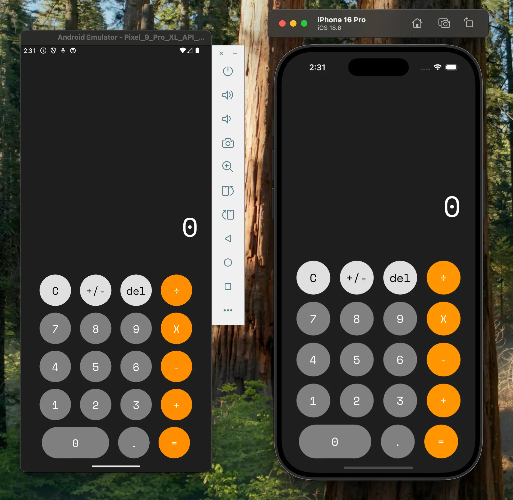

# 🧮 Calculator App

Una aplicación de calculadora moderna desarrollada con **React Native** y **Expo**, que ofrece una experiencia de usuario fluida y funcionalidades completas de cálculo.

## ✨ Características

- **Interfaz moderna y elegante** con diseño oscuro
- **Operaciones matemáticas completas**: suma, resta, multiplicación, división
- **Funcionalidades avanzadas**:
  - Cambio de signo (+/-)
  - Eliminación del último dígito
  - Limpieza completa (C)
  - Soporte para números decimales
  - Cálculo en tiempo real
- **Feedback háptico** para mejor experiencia de usuario
- **Diseño responsive** que se adapta a diferentes tamaños de pantalla
- **Tipografía personalizada** con Space Mono

## 🛠️ Tecnologías Utilizadas

- **React Native** - Framework principal
- **Expo** - Plataforma de desarrollo
- **TypeScript** - Tipado estático
- **Expo Router** - Navegación
- **Expo Haptics** - Feedback táctil
- **React Hooks** - Gestión de estado

## 📱 Capturas de Pantalla



La aplicación presenta una interfaz limpia con:

- Pantalla de resultados en la parte superior
- Botones organizados en filas
- Colores distintivos para diferentes tipos de operaciones
- Diseño oscuro para mejor legibilidad

## 🚀 Instalación y Configuración

### Prerrequisitos

- **Node.js** (versión 18 o superior)
- **npm** o **yarn**
- **Expo CLI** (opcional, pero recomendado)

### Pasos de Instalación

1. **Clonar el repositorio**

   ```bash
   git clone https://github.com/tu-usuario/calculator-app.git
   cd calculator-app
   ```

2. **Instalar dependencias**

   ```bash
   npm install
   # o
   yarn install
   ```

3. **Iniciar la aplicación**

   ```bash
   npm start
   # o
   yarn start
   ```

4. **Ejecutar en diferentes plataformas**

   ```bash
   # Para iOS
   npm run ios

   # Para Android
   npm run android

   # Para Web
   npm run web
   ```

## 📁 Estructura del Proyecto

```
calculator-app/
├── app/                    # Páginas principales (Expo Router)
│   ├── _layout.tsx        # Layout principal
│   └── index.tsx          # Pantalla de la calculadora
├── components/            # Componentes reutilizables
│   ├── CalculatorButton.tsx
│   └── ThemeText.tsx
├── constants/             # Constantes del proyecto
│   └── Colors.ts
├── hooks/                 # Custom hooks
│   └── useCalculator.tsx
├── Styles/               # Estilos globales
│   └── global-styles.ts
└── assets/               # Recursos estáticos
    ├── fonts/
    └── images/
```

## 🔧 Funcionalidades Técnicas

### Hook useCalculator

El corazón de la aplicación es el hook personalizado `useCalculator` que maneja:

- Estado de la fórmula actual
- Números previos y actuales
- Operaciones matemáticas
- Validaciones de entrada
- Cálculos en tiempo real

### Componentes Principales

- **CalculatorButton**: Botón reutilizable con feedback háptico
- **ThemeText**: Componente de texto con estilos consistentes
- **Layout principal**: Configuración de tema y navegación

## 🎨 Diseño y UX

- **Paleta de colores oscura** para mejor legibilidad
- **Feedback háptico** en cada interacción
- **Animaciones suaves** en los botones
- **Tipografía Space Mono** para un look técnico
- **Layout responsive** que funciona en móviles y tablets

## 📋 Scripts Disponibles

```bash
npm start          # Inicia el servidor de desarrollo
npm run android    # Ejecuta en Android
npm run ios        # Ejecuta en iOS
npm run web        # Ejecuta en navegador web
npm run lint       # Ejecuta el linter
```

## 🤝 Contribuir

1. Fork el proyecto
2. Crea una rama para tu feature (`git checkout -b feature/AmazingFeature`)
3. Commit tus cambios (`git commit -m 'Add some AmazingFeature'`)
4. Push a la rama (`git push origin feature/AmazingFeature`)
5. Abre un Pull Request

## 📄 Licencia

Este proyecto está bajo la Licencia MIT. Ver el archivo `LICENSE` para más detalles.

---

⌨️ con ❤️ por [Mario Karajallo](https://karajallo.com) 😊

---

⭐ Si te gustó este proyecto, ¡no olvides darle una estrella!
